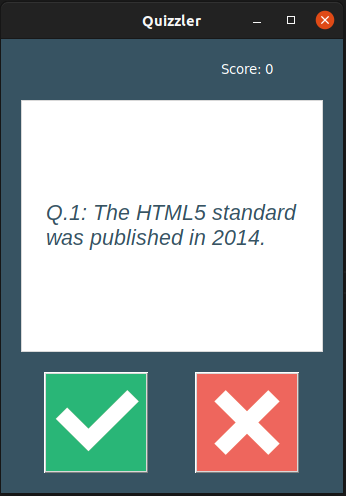

# QUIZZLER_APP

Игра викторина.

Список вопросов берется по API:

    https://opentdb.com/api.php

Интерфейс создан с помощью библиотеки **tkinter**.

## Запуск приложения

Клонировать репозиторий и перейти в него в командной строке:

    git@github.com:avagners/quizzler_app.git
    cd quizzler_app

Cоздать и активировать виртуальное окружение:

    python3 -m venv venv
    source venv/bin/activate

Установить зависимости из файла requirements.txt:

    python3 -m pip install --upgrade pip
    pip install -r requirements.txt

Запустить **main.py**.